# Dev Assessment Platform — User Guide

A practical, step-by-step guide to running technical assessments: building your
question bank, configuring tests, sending links to candidates, and reading the
results.

> **In one sentence:** You build a bank of questions — across several question
> types (multiple choice, matching, ordering, fill-in-the-blank and more) — group
> them into a *test configuration* (technology + seniority + length + pass mark),
> generate a one-off link for each candidate, and the platform auto-grades their
> timed test the moment they submit.

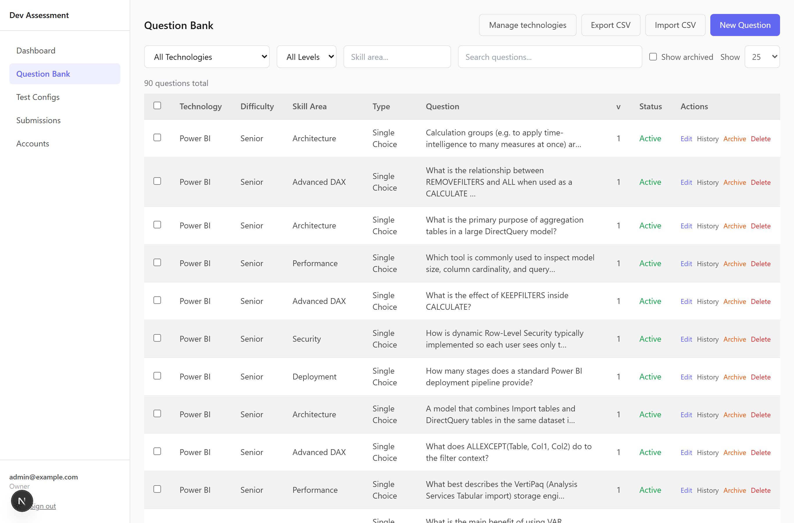
*The Question Bank — the heart of the platform.*

---

## Contents

1. [Who does what — roles](#1-who-does-what--roles)
2. [Signing in](#2-signing-in)
3. [The big picture — how a test flows](#3-the-big-picture--how-a-test-flows)
4. [Building the question bank](#4-building-the-question-bank)
5. [Creating a test configuration](#5-creating-a-test-configuration)
6. [Generating and sharing candidate links](#6-generating-and-sharing-candidate-links)
7. [What the candidate sees](#7-what-the-candidate-sees)
8. [Reading results](#8-reading-results)
9. [The dashboard](#9-the-dashboard)
10. [Managing team accounts](#10-managing-team-accounts)
11. [Your own account settings](#11-your-own-account-settings)
12. [Tips & FAQ](#12-tips--faq)

---

## 1. Who does what — roles

Every admin account has one of three roles. What you can do depends on your role:

| Capability | Owner | Reviewer | Member |
|---|:---:|:---:|:---:|
| View dashboard, submissions & results | ✅ | ✅ | ✅ |
| Generate & share candidate links | ✅ | ❌ | ✅ |
| Create / edit / archive / delete questions | ✅ | ❌ | ❌ |
| Import / export questions (CSV) | ✅ | ❌ | ❌ |
| Create / delete test configurations | ✅ | ❌ | ❌ |
| Delete a submission | ✅ | ❌ | ❌ |
| Manage team accounts | ✅ | ❌ | ❌ |

- **Owner** — full control. Sets up questions, tests, and the team.
- **Reviewer** — read-only. Can see everything but change nothing.
- **Member** — interviewers/recruiters. Can send links and read results, but
  can't touch the question bank or test setup.

If a button described in this guide isn't visible to you, it's almost always a
role restriction.

---

## 2. Signing in

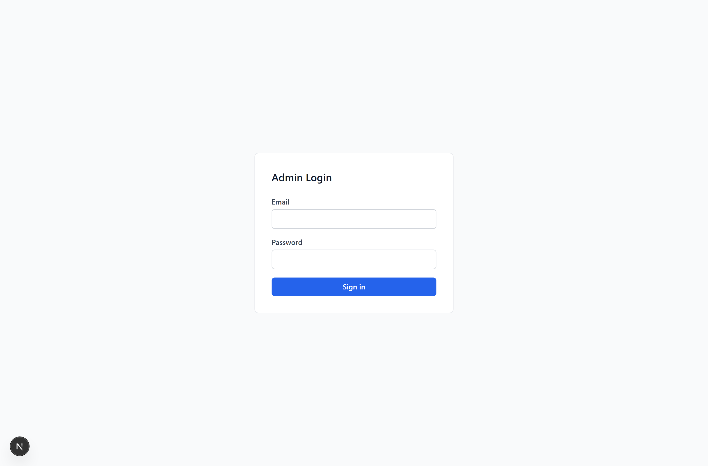

1. Go to the admin site and you'll land on **Admin Login**.
2. Enter your **email** and **password** and click **Sign in**.
3. You're taken into the admin area. Navigation lives in the left sidebar:
   **Dashboard · Question Bank · Test Configs · Submissions** (and **Accounts**
   if you're an Owner).

Other things in the sidebar:

- **Theme toggle** (sun/moon icon, bottom-left) — switch light/dark mode.
- **Your name/email block** (bottom-left) — click it to open **Settings**.
- **Sign out** — next to the theme toggle.

On a phone or narrow screen, tap the **menu (☰)** icon in the top bar to open the
sidebar.

---

## 3. The big picture — how a test flows

```
   ┌─────────────┐     ┌────────────────────┐     ┌──────────────┐
   │  Questions  │ ──▶ │ Test Configuration │ ──▶ │ Candidate    │
   │  (the bank) │     │ (tech + level +    │     │ link         │
   │             │     │  count + pass %)   │     │ (one per     │
   └─────────────┘     └────────────────────┘     │  candidate)  │
                                                   └──────┬───────┘
                                                          ▼
                                                   ┌──────────────┐
                                                   │ Auto-graded  │
                                                   │ result       │
                                                   └──────────────┘
```

1. **Build a question bank** — tag each question with a technology, level, and
   skill area, and pick the right question **type** for what you want to test.
2. **Create a test configuration** — e.g. "Power BI — Mid, 20 questions, pass 70%".
   The platform will randomly pull that many matching questions per candidate.
3. **Generate a link** for a named candidate and share it (copy / email / Teams).
4. The candidate takes a **30-minute timed test** with no login required.
5. On submit, the test is **auto-graded** and appears under Submissions and on the Dashboard.

---

## 4. Building the question bank

> Owner only. Reviewers and Members can view questions but not change them.

Open **Question Bank** from the sidebar. You'll see a searchable, paginated table
of every question. Each row shows its **Type** (e.g. *Single Choice*, *Matching*,
*Ordering*), technology, level, skill area, and a preview of the question text.

### Filtering and finding questions

Use the filter row at the top:

- **Technology** dropdown
- **Difficulty / level** (Junior / Mid / Senior)
- **Skill area** text box (matches partial text, e.g. "DAX")
- **Search** box (searches the question text)
- **Show archived** checkbox — include retired questions
- **Show** (page size) — 10 / 25 / 50 / 100 / All rows per page

### Question types

A question is built from two independent parts:

1. **The stimulus** — what the candidate reads. This can mix **text**, a
   syntax-highlighted **code** snippet, and an uploaded **image** (e.g. a model
   diagram or a screenshot).
2. **The answer** — how the candidate responds. Choose one of six types:

| Type | The candidate… | Graded |
|---|---|---|
| **Single choice** | picks one option (classic A/B/C/D) | exact |
| **Multiple select** | ticks every option that applies | all-or-nothing |
| **True / False** | picks True or False | exact |
| **Matching** | pairs each item on the left with one on the right | all-or-nothing |
| **Ordering** | drags items into the correct order | all-or-nothing |
| **Fill in the blank** | types the missing word(s) into `___` gaps | all-or-nothing |

Every type is **auto-graded instantly** — there's no manual marking step. Grading
is **all-or-nothing**: a question counts as correct only if the *whole* answer is
right (e.g. all matches correct, the full order correct). Scores stay a simple
"questions correct ÷ questions asked".

### Adding a single question

1. Click **New Question** (top-right).
2. Fill in the shared fields:
   - **Technology** — pick from the list.
   - **Difficulty** — Junior / Mid / Senior. This is what test configs match against.
   - **Skill Area** — a free-text tag, e.g. `DAX`, `Data Modelling`, `Visuals`.
     Skill areas drive the per-skill breakdown on results, so keep them consistent.
   - **Type** — choose one of the six types above. The answer editor below changes
     to match.
3. Build the **Question stimulus** using the block buttons:
   - **+ Text** — a paragraph the candidate reads.
   - **+ Code** — a code block with a language label (e.g. `dax`, `sql`, `m`),
     shown to the candidate in monospace.
   - **+ Image** — upload a PNG/JPEG/WEBP/GIF (up to 1 MB). It's stored with the
     question and shown inline.
   You can add several blocks and remove any with **remove**.
4. Fill in the **answer editor** for your chosen type (see below).
5. *(Optional)* add an **Explanation** — shown internally; helps reviewers and exports.
6. Click **Save Question**.

#### The answer editor, per type

**Ordering** — type the items in the **correct** order; candidates see them
shuffled and drag them back into place.

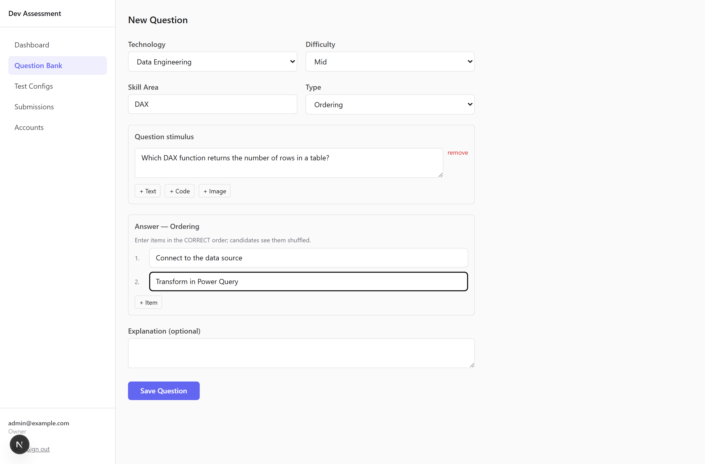

**Fill in the blank** — put `___` (three underscores) wherever you want a gap in
your stimulus **text**, then give the accepted answers for each blank
(comma-separated, so you can allow variants like `ALL, ALL()`). Matching is
case-insensitive and ignores surrounding spaces. *(Markers only work in text
blocks, not inside code blocks.)*

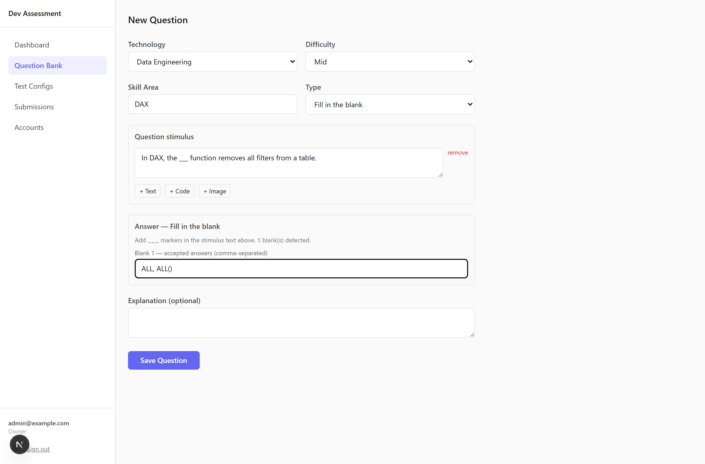

**Matching** — type each correct pair on one row (left ↔ right). The right column
is shuffled for the candidate.

**Single / Multiple choice** — type the options and mark the correct one(s):
a radio button for single choice, checkboxes for multiple select.

**True / False** — just pick which is correct.

> **Tip — fairness by design:** for matching and ordering, the platform shuffles
> the options independently for every candidate, so the on-screen order never
> gives the answer away.

### Editing a question — and how versioning works

Click **Edit** on any row. Important behaviour:

- **Editing never overwrites history.** Saving an edit creates a **new version**
  (the form tells you: *"Editing v2 — saving will create v3"*).
- Any candidate who already took a test keeps the **exact version** of the
  question they saw. Their past results never change underneath them.
- Click **History** on a row to see every version with timestamps; the current
  one is marked **(current)**.
- You can change a question's **type** when editing — but if you do, re-check the
  answer editor, since the answer fields differ per type.

### Retiring vs deleting a question

You have two ways to remove a question — they are very different:

- **Archive** (orange) — *reversible.* Hides the question from future tests but
  keeps it in the system and tied to past submissions. This is the safe default.
  Tick **Show archived** to see and restore archived questions.
- **Delete** (red) — *permanent.* Only works if the question has **never** been
  used in a submission. If it has been used, the platform blocks the delete and
  tells you to archive it instead.

### Bulk actions

Tick the checkboxes on the left of each row (or the header checkbox to select the
page). A bar appears at the bottom of the screen:

- **Archive N selected** — hide many at once (reversible).
- **Delete N selected** — permanently delete many at once. Any that are in use
  are skipped and listed back to you, so the rest still go through.

### Import questions from CSV (bulk add)

This is the fastest way to load a large bank of **single-choice** questions.

1. On Question Bank, click **Import CSV** and choose your file.
2. The platform processes every row and shows a summary:
   **"Import complete: N imported"**, plus a per-row error table for anything
   that failed (so you can fix just those rows and re-import).

**CSV format** — a header row plus one row per question, in this exact column
order:

| Column | Required | Notes |
|---|---|---|
| `technology` | ✅ | The technology **slug** (not display name) — e.g. `power-bi` |
| `difficulty` | ✅ | `junior`, `mid`, or `senior` |
| `skill_area` | ✅ | Free text, e.g. `DAX` |
| `text` | ✅ | The question |
| `option_a` | ✅ | |
| `option_b` | ✅ | |
| `option_c` | ✅ | |
| `option_d` | ✅ | |
| `correct_option` | ✅ | `a`, `b`, `c`, or `d` |
| `explanation` | optional | Last column, may be left blank |

Notes:
- **CSV is for single-choice questions only.** The richer types (matching,
  ordering, fill-in-the-blank, multiple select, true/false) are created in the
  **New Question** form, where you can add code and images.
- The **easiest way to get a valid template** is to click **Export CSV** first —
  it produces a file in exactly this shape that you can edit and re-import.
- The technology must already exist; an unknown slug is reported as an error for
  that row.
- Quoted fields (commas, line breaks inside a cell) are handled correctly.
- Max file size 5 MB.

### Export questions to CSV

Click **Export CSV**. A short dialog lets you choose the **scope** — the
**selected** rows, the **current page**, or **all** rows matching your current
filters. The export covers single-choice questions and comes out in the exact
shape the importer expects, so you can edit it and re-import.

### Managing technologies

Click **Manage technologies** (Owner only) to add, rename, archive, or delete the
technologies that questions and tests are organised under. Deleting a technology
that still has questions or live links is guarded — you'll be offered a safe
**Archive** instead.

---

## 5. Creating a test configuration

> Owner only.

A *test configuration* is the recipe for a test. It says: *"For this technology
at this level, give each candidate this many random questions, and they pass at
this percentage."*

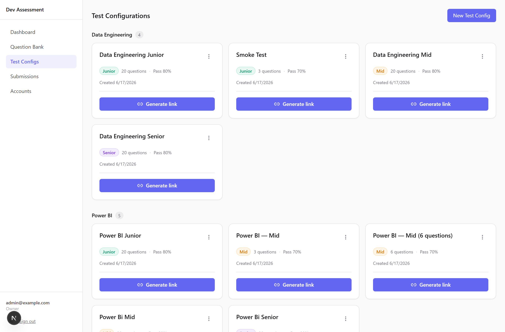

Open **Test Configs**. Existing configs are shown as cards, **grouped by
technology** and ordered Junior → Mid → Senior. Each card shows the level, the
number of questions, the pass mark, and a coloured difficulty badge.

To create one:

1. Click **New Test Config** (top-right).
2. Fill in:
   - **Name** — what you'll recognise it by, e.g. `Power BI Mid Test`.
   - **Technology** — questions are pulled from this technology's bank.
   - **Difficulty** — only questions at this level are eligible.
   - **Number of Questions** — how many each candidate gets (1–100, default 20).
   - **Pass Threshold %** — the score needed to pass (default 70%).
3. Click **Create Test Config**.

> ⚠️ **Make sure the bank has enough questions** at that technology + level. If
> there aren't enough to fill the requested count, you may see a warning — add
> more questions or lower the count. (Question **type** doesn't matter here — a
> test mixes whatever types are in the eligible pool.)

**How question selection works:** each candidate link gets a *random but fair*
set drawn from the matching pool. The selection is **seeded to the link**, so:

- The *same link* always shows the *same questions* (e.g. on a page refresh).
- *Different candidates* get *different but equivalent* sets at the same level.

### Deleting a test config

On a config card, click the **⋮ (kebab) menu** → **Delete**. You'll be asked to
confirm. This is permanent.

---

## 6. Generating and sharing candidate links

> Owner and Member roles can generate links.

Each candidate gets their **own** link. There are two ways to create one.

### Quick way — from the Test Configs cards (recommended)

1. On the **Test Configs** page, find the right card.
2. Click **Generate link**.
3. In the dialog, type the **Candidate name** (required — it labels their
   submission; the candidate themselves never logs in).
4. Click **Generate link**. The link appears, ready to share:
   - **Copy** — copies the URL to your clipboard.
   - **Email** — opens a pre-written email with the link.
   - **Teams** — opens Microsoft Teams to share it.
   - **More…** — your device's native share sheet (where available).
5. Click **Generate another** to make a link for the next candidate, or **Done**.

### Detailed way — from the links list

1. On a Test Config card, click **⋮** → **View links & results**.
2. Use the **Candidate Name** box (optional here) and **Generate New Link**.
3. The new URL appears in a green panel with a **Copy** button.

This page also gives you a full table of every link for that config:

| Column | Meaning |
|---|---|
| **Candidate** | The name you entered (or `—`) |
| **Token** | Short ID of the link |
| **State** | `pending` → `started` → `submitted` (or `expired`) |
| **Created / Started / Submitted** | Timestamps as the candidate progresses |
| **Actions** | **View result** once submitted; **Revoke** to kill an unused link (Owner only) |

> **Revoke** invalidates a link that hasn't been used yet — handy if you sent it
> to the wrong person. You can't revoke a test that's already submitted or expired.

---

## 7. What the candidate sees

You don't need to do anything here, but it helps to know what you're sending:

- They open the link — **no login, no signup**. The test starts immediately.
- A **30-minute countdown** runs in the header (green → amber → red). The clock
  is enforced on the server, so it can't be cheated by closing the tab.
- They answer one question at a time, moving with **Previous / Next**, and can
  jump around using the **question map**. A counter shows how many they've
  answered.

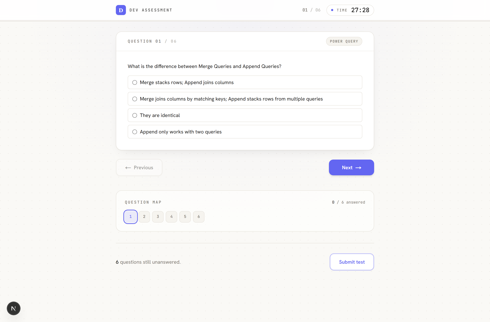

- **Each question type has its own controls** — radio buttons or checkboxes for
  choice questions, **drop-downs** for matching, **reorder** controls for ordering,
  and **inline boxes** for fill-in-the-blank. Code and images in the question are
  shown right above the answer.

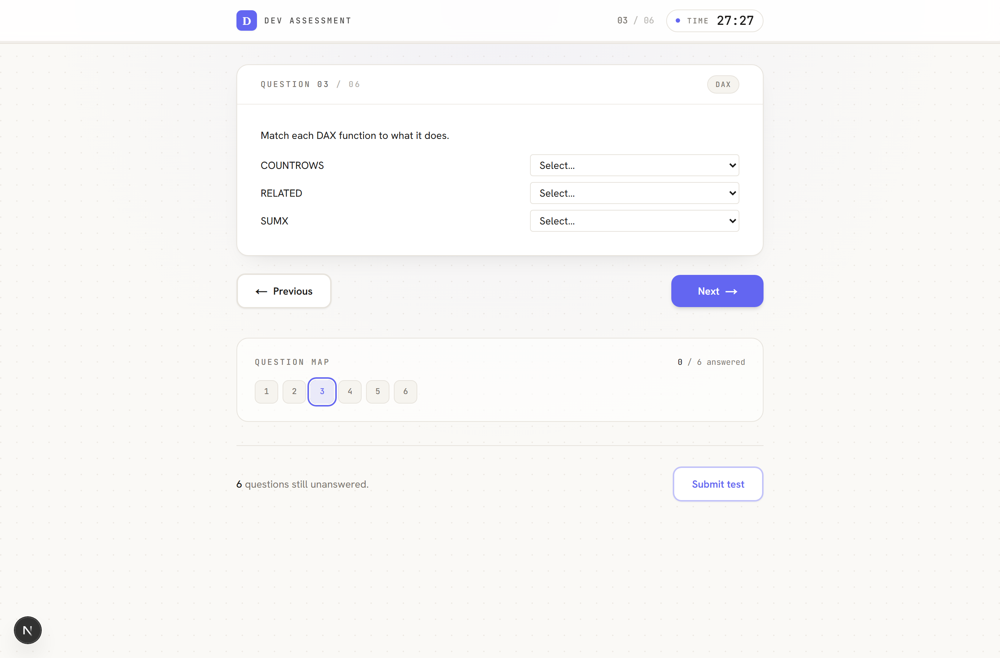

- If they **refresh or briefly lose connection**, the test resumes with the right
  remaining time and their answers intact.
- On the last question, the primary button becomes **Submit test**; they can also
  submit early at any time (with a confirmation step).
- If time runs out, the test **auto-submits**.
- They immediately see a **results page**: overall score, pass/fail verdict,
  time taken, a per-skill breakdown, and a full answer sheet.

---

## 8. Reading results

Open **Submissions** from the sidebar for the full, paginated list of completed
tests (newest first).

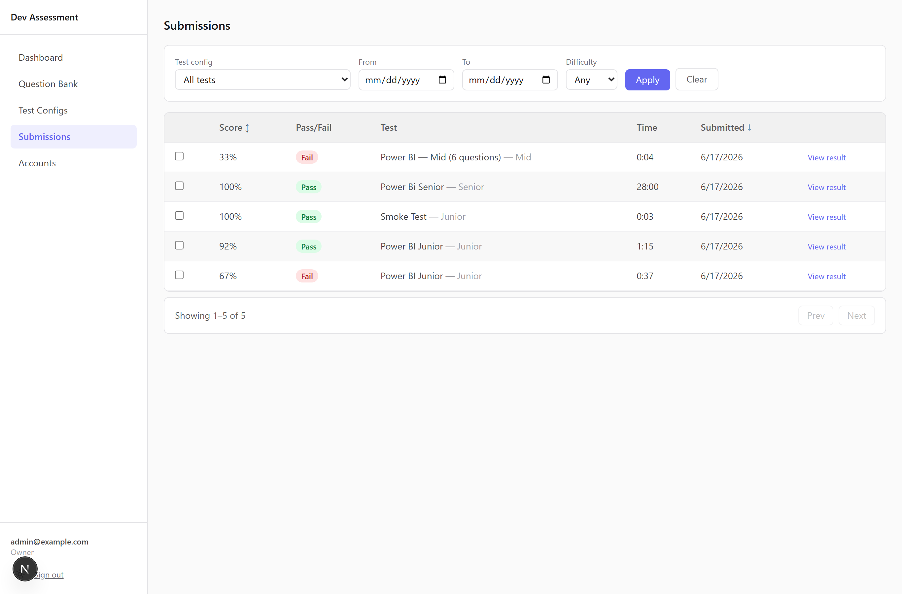

### Filtering and exporting

The filter bar lets you narrow by **Test config**, **date range (From/To)**, and
**Difficulty**. Click **Apply** (or **Clear** to reset).

- When you pick a single **Test config**, a stats panel appears above the table:
  total submissions, average score, pass rate, and a score-distribution bar chart
  for *that* test — plus an **Export CSV** button to download those submissions.

### The submissions table

Each row shows **Score**, **Pass/Fail**, the **Test** and level, **Time** taken,
and the **Submitted** date. Click the **Score** or **Submitted** headers to sort.
Click **View result** to drill in.

### Comparing candidates side by side

Tick the checkbox on **two or more** rows. A bar appears at the bottom — click
**Compare selected** to see them side by side (great for choosing between
shortlisted candidates).

### A single candidate's result

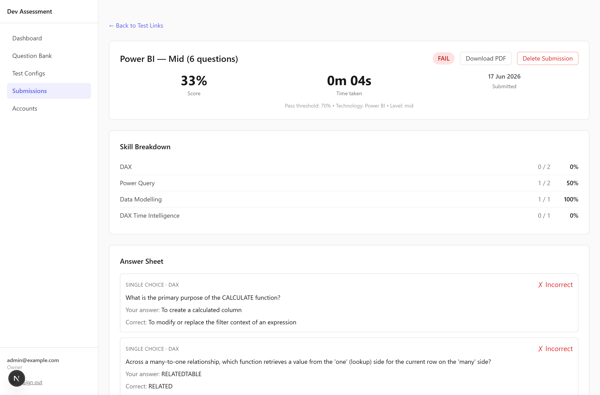

The detail page shows:

- A **summary card** — score %, time taken, submission date, the pass threshold,
  technology, and level, with a clear **PASS/FAIL** badge.
- A **skill breakdown** — how they did in each skill area (correct/total and %).
- The **full answer sheet** — every question rendered in its own type, showing the
  candidate's answer, the correct answer, a ✓/✗ result, and which question version
  they saw. (The candidate sees the same answer sheet on their own results page.)

The candidate's own results page mirrors this:

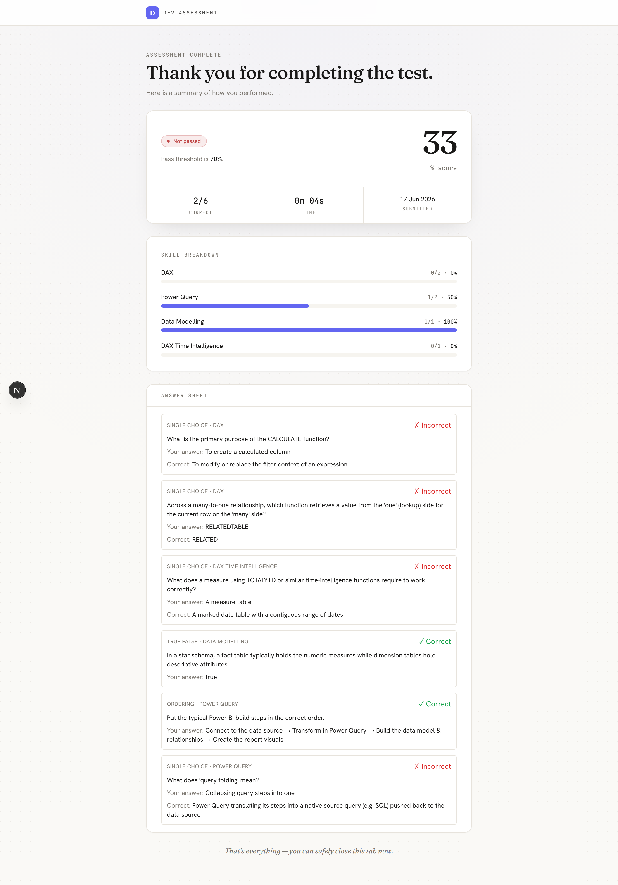

Two buttons (top-right of the admin view):

- **Download PDF** — opens your browser's print dialog with a clean,
  print-friendly layout (save as PDF or print).
- **Delete Submission** *(Owner only)* — permanently removes this result. Use
  with care.

---

## 9. The dashboard

**Dashboard** (sidebar) is your at-a-glance overview across all candidates.
Everyone with an account can view it.

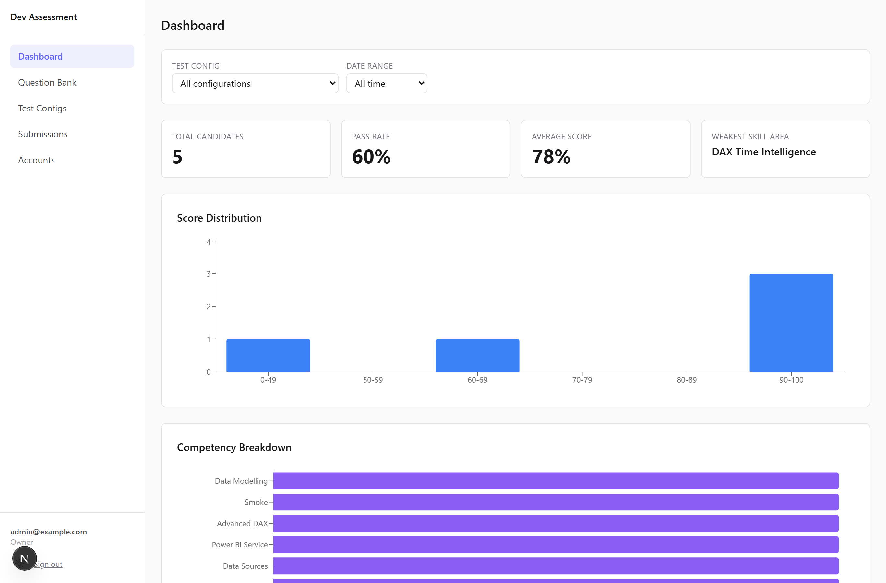

- **Filter bar** — narrow everything below by **Test config** and **Date range**
  (All time / Last 7 / 30 / 90 days / Custom). For Custom, fill both From and To.
- **KPI cards** — Total Candidates, Pass Rate, Average Score, and the **Weakest
  Skill Area** across the selection.
- **Score Distribution** — how scores cluster across bands (0–49 … 90–100).
- **Competency Breakdown** — average score per skill area, so you can see where
  candidates collectively struggle.
- **Recent Candidates** — the latest submissions with score and pass/fail.

---

## 10. Managing team accounts

> Owner only. The **Accounts** item only appears in the sidebar for Owners.

1. Open **Accounts** to see all admin users, their **role**, and when they were created.
2. Click **Create Account**, then fill in:
   - **Name**
   - **Email** (their login)
   - **Role** — Owner / Reviewer / Member (see [roles](#1-who-does-what--roles))
   - **Password** — minimum 8 characters
3. Click **Create Account**.

- **Edit** a row to change someone's name or role.
- **Delete** a row to remove an account (with confirmation). The system prevents
  deletions that would leave the team without an owner.

---

## 11. Your own account settings

Click your **name/email** at the bottom of the sidebar to open **Settings**.

- **Display Name** — update the name shown across the app. You must enter your
  **current password** to confirm the change. (Your email can't be changed here.)
- **Change Password** — enter your current password, then your new password
  twice (minimum 8 characters).

---

## 12. Tips & FAQ

**Which question type should I use?**
Use **single / multiple choice** for knowledge checks, **true/false** for quick
concept checks, **matching** to test "which goes with which" (function ↔ purpose),
**ordering** for processes and pipelines, and **fill-in-the-blank** to test exact
syntax or terminology. Add a **code** or **image** block to any of them when the
question needs context.

**Why can't I import matching/ordering questions via CSV?**
CSV import covers single-choice only. The richer types are quick to build in the
**New Question** form, where you also get code blocks and image uploads.

**How is a multi-part question graded?**
All-or-nothing: a matching, ordering, or multiple-select question is correct only
if every part is right. There's no partial credit, which keeps scores simple and
comparable.

**How many questions should a test config have?**
Fewer than the eligible pool at that technology + level. If the pool is smaller
than the requested count you'll get a warning — add questions or lower the count.

**Can I reuse one link for several candidates?**
No — generate one link per candidate so results are attributed correctly. A link
is tied to a single sitting.

**I sent a link to the wrong person — what now?**
If they haven't started, open **View links & results** for that config and
**Revoke** the link (Owner only), then generate a fresh one.

**A candidate's connection dropped mid-test — did they lose everything?**
No. The test resumes on refresh with the correct remaining time and their saved
answers. The timer is server-enforced, so the total time is unaffected.

**I need to fix a typo in a live question.**
Edit it — this creates a new version for future tests. Candidates who already sat
the test keep the version they saw, so existing results stay valid.

**I want to remove a question but it's been used in tests.**
Use **Archive**, not Delete. Archiving hides it from future tests while keeping
past results intact. Delete is only allowed for never-used questions.

**Where do pass/fail thresholds come from?**
Each test configuration sets its own **Pass Threshold %** (default 70%). A
candidate's pass/fail is decided against the threshold of the config they took.

**How do I get a printable/PDF copy of a result?**
Open the submission and click **Download PDF** — it uses your browser's print
dialog with a clean layout.
